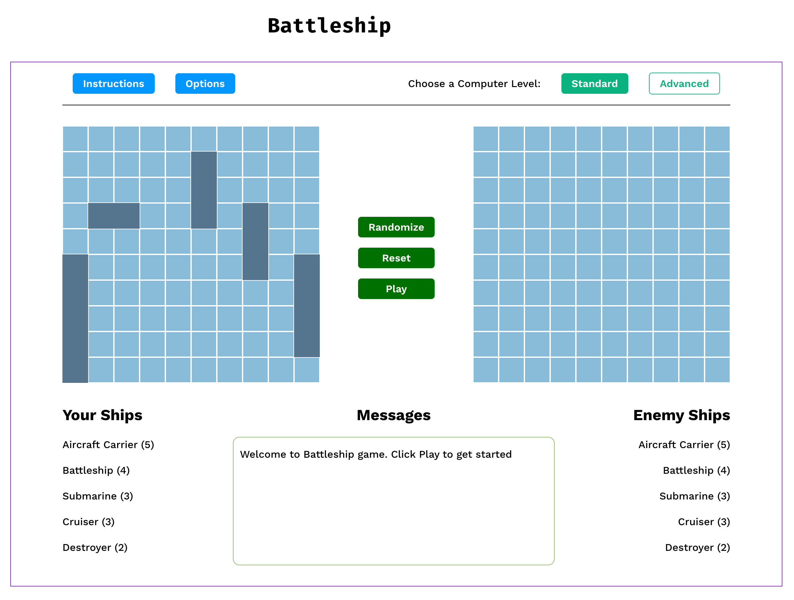
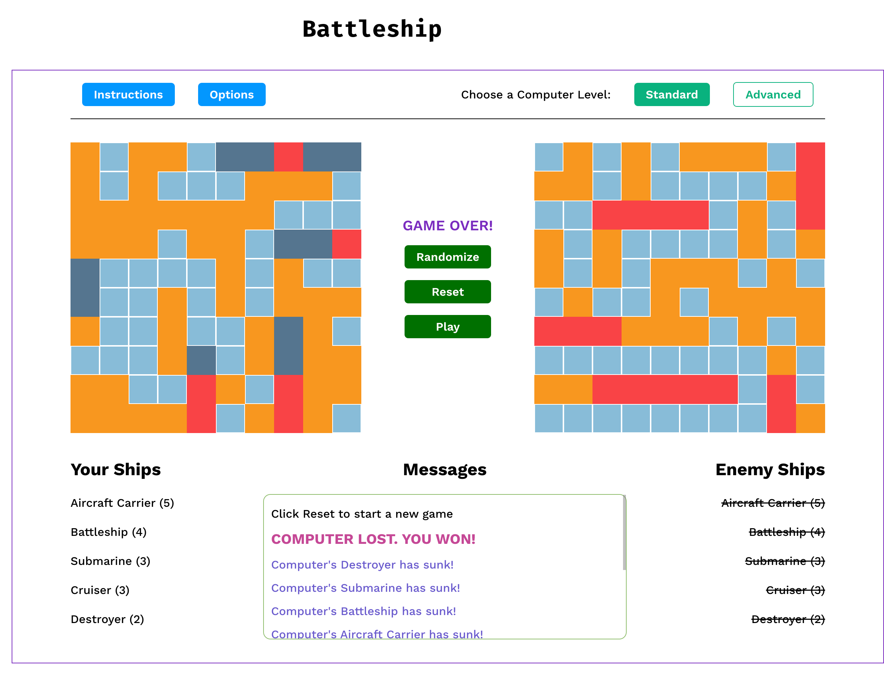

# Solution for Project Battleship (The Odin Project)

This is a solution for the [Battleship project on The Odin Project](https://www.theodinproject.com/lessons/node-path-javascript-battleship)

## Table of contents

- [Solution for Project Battleship (The Odin Project)](#solution-for-project-battleship-the-odin-project)
  - [Table of contents](#table-of-contents)
  - [Overview](#overview)
    - [Rules](#rules)
    - [Instructions](#instructions)
    - [Screenshots](#screenshots)
    - [Links](#links)
  - [Credits](#credits)

## Overview

This is an online two player Battleship game where each player secretly arranges a fleet of ships on a 10 x 10 grid. In this game, players take turns shooting at the other player's ships by clicking on the enemy grid squares. The shots are marked with 'red' for a hit and 'orange' for a miss. When a player hits all ship squares of a ship, they sink the ship. The game ends when one player sinks all of the other player's ships. The first player to sink all of the opponent's ships wins.

### Rules

- Each player places their ships (The AI places its ships randomly, and it cannot see where you've placed your ships).
- The ships may not overlap or touch each other and they can only be placed within the grid boundaries.
- The ships can be placed either horizontally or vertically, but never diagonally.
- The players take turns taking shots at squares. The results are either "hit" or "miss".
- The winner is the first player to sink all of the other player's ships.

### Instructions

- Click 'Randomize' button to place ships randomly.
- Drag and drop ships to move them to a different position.
- Change ship direction by clicking on any of its squares.
- Pick between Standard and Advanced Computer levels.
- Click 'Play' button to start the game.
- Click 'Reset' button to reset the game.
- Click on a enemy board square to make a move. It turns 'red' for a successful hit and 'orange' for a missed hit.
- Watch 'Messages' box to see game updates.

### Screenshots

|  |  |
|:-----------------------------------------------: | :--------------------------------------------------:|
|                <em>Initial game state</em>                  |                <em>Finished game state</em> | 

### Links

- Solution URL: [https://github.com/py-code314/weather-app](https://github.com/py-code314/weather-app)
- Live Site URL: [https://py-code314.github.io/weather-app/](https://py-code314.github.io/weather-app/)

## Credits

- All animated weather icons are from [meteocons.com](https://github.com/basmilius/weather-icons), thanks to [Bas Milius](https://github.com/basmilius)
- Spinner icon is from [loading.io](https://loading.io/spinner/blocks/-rectangle-square-rotate-cycle-adobe)
- Gradient background images for daytime and nighttime are from [cssgradient.io](https://cssgradient.io/)
- Default background image 'Hand drawn adventure background' from [freepik.com](https://www.freepik.com/free-vector/hand-drawn-adventure-background_16665121.htm#fromView=search&page=1&position=14&uuid=30f0a776-df6b-440e-b0c4-13690c8bc096&query=Nature+Illustration)

